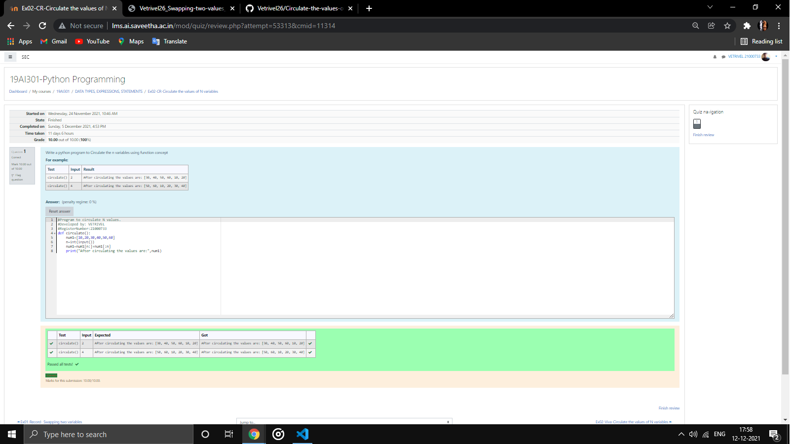

# Circulate-the-values-of-N-variables
## Aim:
To write a python program to circulate the n variables using function concept
## Equipment’s required:
PC
Anaconda - Python 3.7
## Algorithm: 
### Step 1:
import def circulate

### Step 2:
prepare the lists form linear equations

### Step 3:
Get the value from the user for the number of rotation

### Step 4:
Using the slicing concept rotate the list

### Step 5:
print the value it would be circulated

### Step 6:
end the program
## Program:
```
def circulate(): 
    num1=[10,20,30,40,50,60]
    n=int(input())
    num1=num1[n:]+num1[:n]
    print("After circulating the values are:",num1)
```
## Output:


## Result:
Thus circulate the values  of N variables is executed
